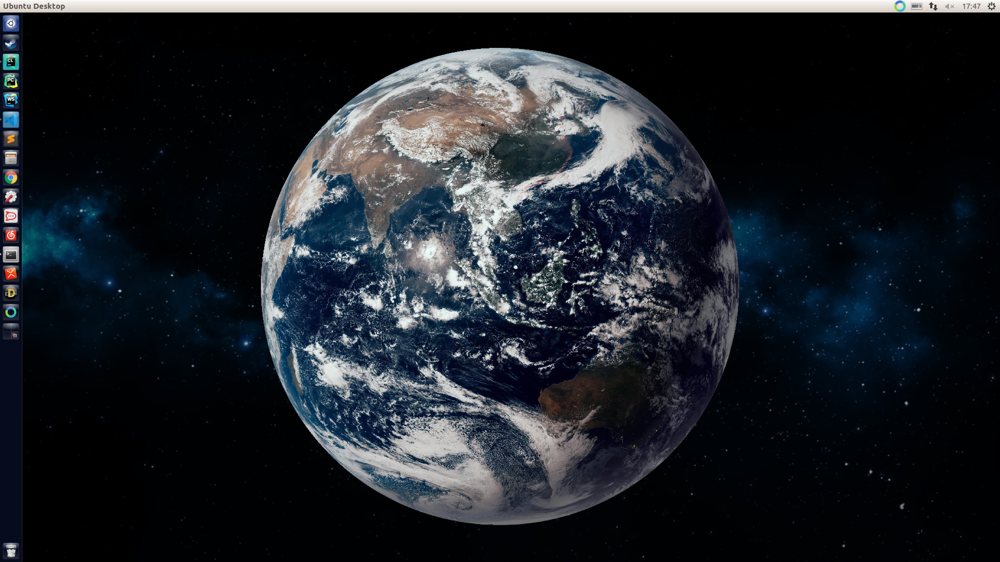

# Dynamic Earth Wallpaper

## environment

* Ubuntu 14/16(gnome)
* python 2.7
* numpy
* OpenCV(cv2)
* crontab

## install 

1. modify `bashpath` and `python_client` in `run.sh`.
2. run `./run.sh`
3. check log file.
4. run `crontab cron_tasks.ini`
5. check `crontab -l`
6. `System Settings` --> `Apperance` --> `Background` --> select black as background color.
